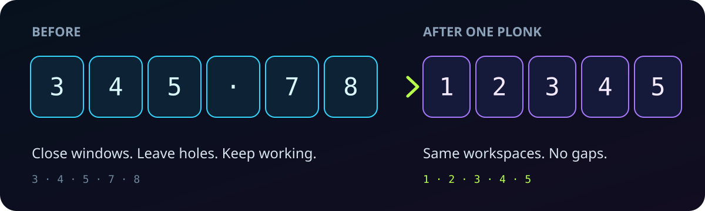
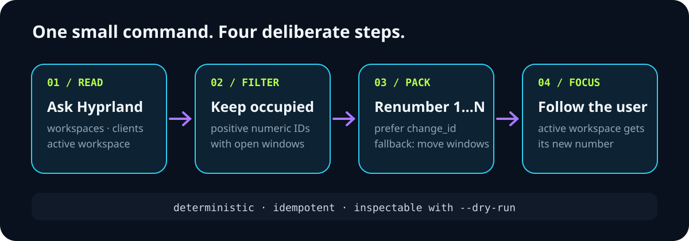
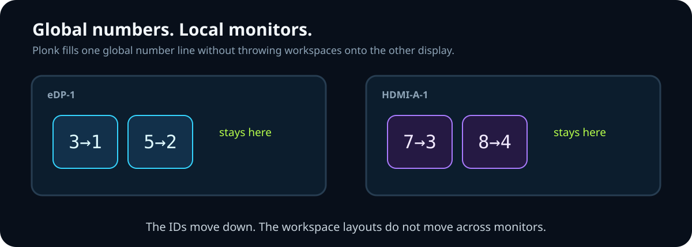
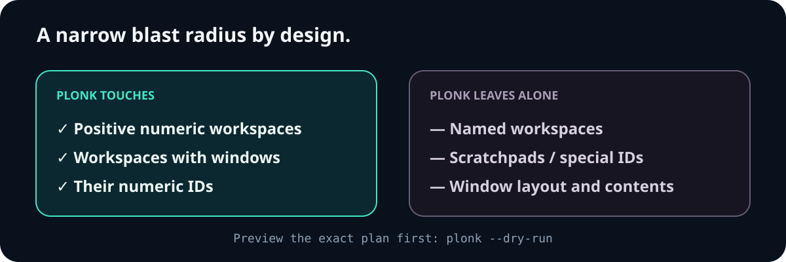

<div align="center">


# plonk

### Close the gaps in your Hyprland workspaces.

One keystroke turns a scattered workspace number line into `1…N`—without rearranging your windows or sending workspaces to the wrong monitor.

[](plonk)
[](https://hypr.land)
[](https://omarchy.org)
[](LICENSE)

```bash
curl -fsSL https://raw.githubusercontent.com/nixfred/plonk/main/plonk -o ~/.local/bin/plonk && chmod +x ~/.local/bin/plonk
```

</div>

## Your workspace bar has holes. Plonk removes them.

You open windows on workspaces 1–11, close a few, and end up working on 3, 4, 5, 7, 8, 9, 10, and 11. Run `plonk` and those occupied workspaces become 1–8, in the same order.



```console
$ plonk --dry-run
would plonk workspace 3 -> 1 (eDP-1)
would plonk workspace 4 -> 2 (eDP-1)
would plonk workspace 5 -> 3 (eDP-1)
would plonk workspace 7 -> 4 (eDP-1)

$ plonk
plonked workspace 3 -> 1 (eDP-1)
...

$ plonk
plonk: Already Plonked!
```

It is safe to bind and safe to mash: once the number line is compact, another run is a no-op.

## How it works



Hyprland workspace IDs are global. Plonk reads the compositor's workspace and client state, sorts occupied numeric workspaces, and assigns the lowest available IDs in order.

When the destination is free, it prefers `hl.dsp.workspace.change_id`: the workspace keeps its monitor, windows, and tiling layout. If an empty persistent workspace already owns the target ID—or the Lua dispatcher is unavailable—Plonk falls back to moving the windows and pins the destination to the original monitor.

Your active workspace follows its new number, so the desktop does not pull focus out from under you.

## Multi-monitor means one number line



Workspace IDs do not restart per display. Plonk therefore compacts them globally to avoid collisions, while keeping each workspace on the monitor where it began.

For example, workspaces 3 and 5 on `eDP-1` plus 7 and 8 on `HDMI-A-1` become 1, 2, 3, and 4. The first pair stays on `eDP-1`; the second pair stays on `HDMI-A-1`.

## What it will—and will not—touch



- Special and scratchpad workspaces (`id < 1`) are ignored.
- Named workspaces are ignored.
- Titles from the [nixfred.workspace-names](https://github.com/nixfred/workspace-names) plugin (`~/.config/omarchy/workspace-names.json`, keyed by workspace id) **travel with their workspace** when it is renumbered. The file is snapshotted before every rewrite (last 20 in `~/.local/state/plonk/names-backups/`), an unnamed workspace arriving on a slot never deletes the slot's title, and plonk never removes a title on its own. Override the path with `WORKSPACE_NAMES_FILE`.
- If you were sitting on an empty workspace above the pack, you land on the first free slot.
- Every run sends a short desktop notification (`Plonked 3 workspaces` / `Already Plonked!`) via `omarchy-notification-send` or `notify-send` when present.
- Window contents and tiling are preserved when the native ID-change dispatcher is available.
- `--dry-run` prints the complete move plan without dispatching anything.

## Install

Plonk needs only `hyprctl` and `jq`; both ship with Omarchy.

```bash
curl -fsSL https://raw.githubusercontent.com/nixfred/plonk/main/plonk -o ~/.local/bin/plonk
chmod +x ~/.local/bin/plonk
```

Preview the plan, then compact:

```bash
plonk --dry-run
plonk
```

## Bind it to a key

### Omarchy / Hyprland 0.56+

Add this to `~/.config/hypr/bindings.lua`, then run `hyprctl reload`:

```lua
o.bind("SUPER + MINUS", "Plonk: compact workspaces", "plonk")
```

`SUPER + MINUS` is unbound in stock Omarchy 4.x. If you choose another shortcut, check it first with `hyprctl binds -j`.

### Plain Hyprland configuration

```ini
bind = SUPER, MINUS, exec, plonk
```

## Test without touching a compositor

The regression suite replaces `hyprctl` with a local stub. It covers no-op runs, gap collapse, dry-run behavior, multi-monitor numbering, named workspaces, active-workspace focus, invalid compositor data, and the persistent-workspace fallback.

```bash
bash test.sh
```

## Upstream

Plonk has been proposed for Omarchy as `omarchy-hyprland-workspace-compact` in [basecamp/omarchy#7727](https://github.com/basecamp/omarchy/pull/7727). The companion design discussion is [Show and Tell #7728](https://github.com/basecamp/omarchy/discussions/7728).

## License

[MIT](LICENSE)

## Auto-plonk (watch mode)

`plonk --watch` stays running and closes a gap when it actually appears: a window opened above a gap, last window closed or moved off a workspace, a workspace destroyed or moved, a monitor added or unplugged, or Hyprland reloaded — plus once right after it connects, so holes that predate the daemon (or survived a Hyprland restart) are closed too. Switching onto an empty workspace does **not** fill it — that hole closes when you leave, because filling the workspace under you would pull another workspace's windows into view. It is quiet, will not dump windows onto the empty workspace you are sitting on (on any monitor), pauses while the hyprshell/Swish switcher overlay is open (verified against `hyprctl layers`, so a missed close event cannot wedge it), follows a live Hyprland instance if the compositor restarted underneath it, and takes a lock in `~/.local/state/plonk/` so a manual `plonk` never races it. Needs `socat`. A trigger compacts immediately, then watches a bounded ~250 ms wall-clock settle window (`PLONK_SETTLE_US`) for a second real change. Events emitted by Plonk's own fallback are ignored, continuous `windowtitle` events cannot starve it, and a hole that opens during the settle is not lost.

Run it as a user service (the unit is in this repo):

```bash
curl -fsSL https://raw.githubusercontent.com/nixfred/plonk/main/plonk.service -o ~/.config/systemd/user/plonk.service
systemctl --user daemon-reload && systemctl --user enable --now plonk.service
```

The unit expects `plonk` at `~/.local/bin/plonk` (edit `ExecStart` otherwise). `plonk --watch --notify` adds the desktop notifications. Manual `plonk` and the keybind keep working alongside it.
